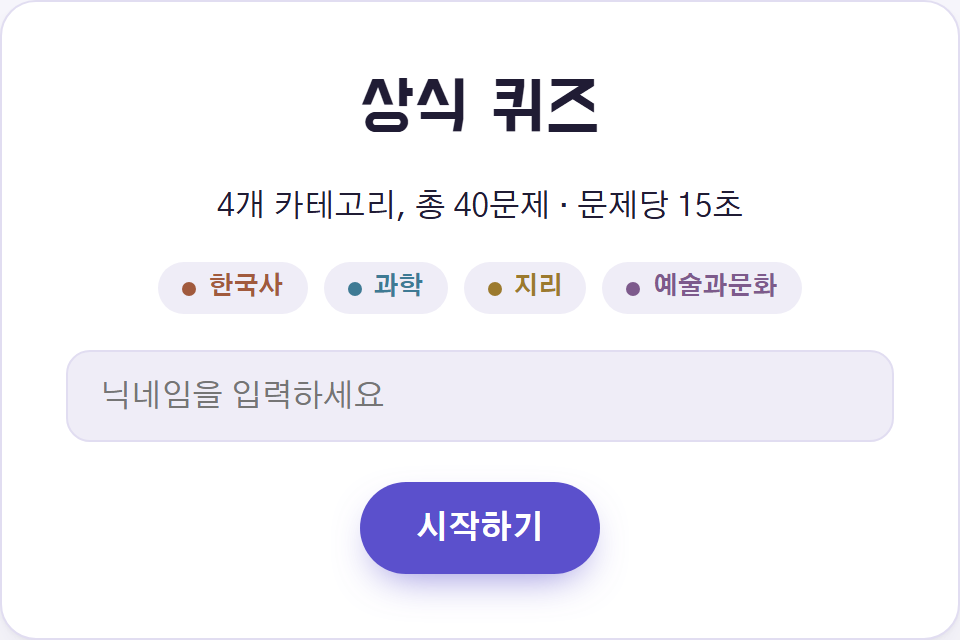
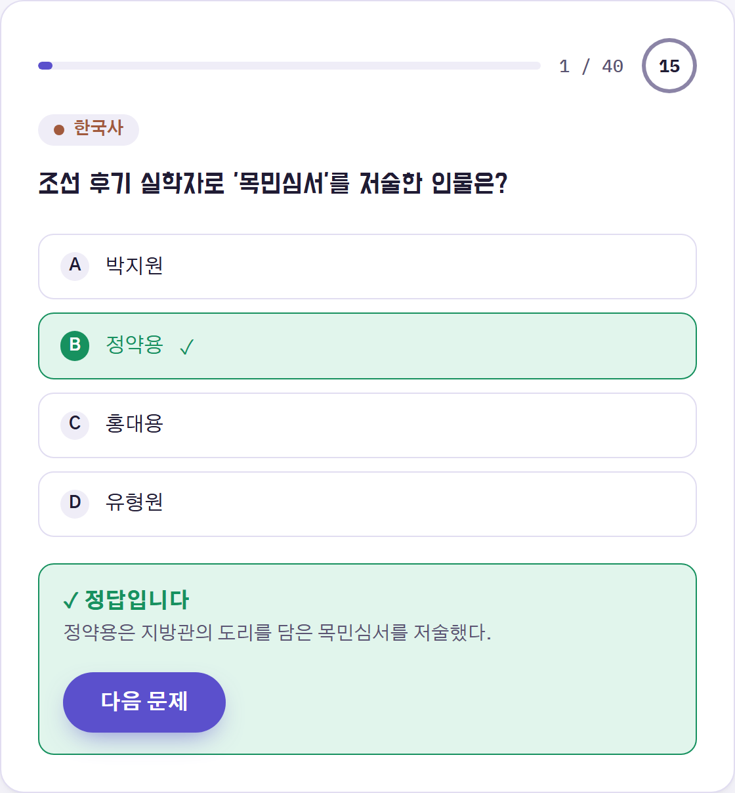
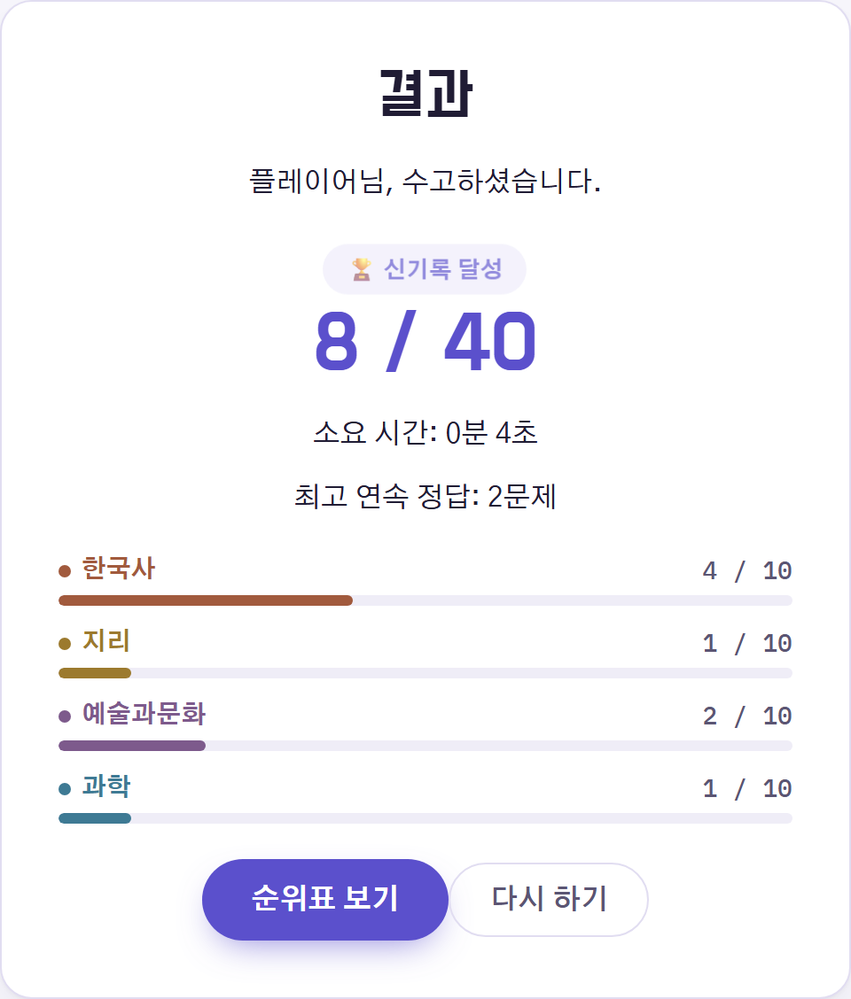

# 상식 퀴즈


한국사 · 과학 · 지리 · 예술과 문화 4개 카테고리, 총 40문제로 구성된 4지선다 상식 퀴즈 게임입니다. 문제마다 15초 제한 시간이 있고, 답을 고르면 즉시 정답 여부를 알려줍니다. 다 풀면 점수와 카테고리별 정답률, 최고 연속 정답 기록을 보여주고, 브라우저에 순위표로 저장됩니다.

## 미리보기

<table>
  <tr>
    <td align="center" width="33%"><br><sub>시작 화면</sub></td>
    <td align="center" width="33%"><br><sub>퀴즈 진행 · 즉시 피드백</sub></td>
    <td align="center" width="33%"><br><sub>결과 화면</sub></td>
  </tr>
</table>

## 게임 규칙

- 4지선다 객관식, 카테고리당 10문제씩 총 40문제
- 문제당 제한 시간 15초 — 시간 초과 시 자동 오답 처리 후 다음 문제로 전환
- 정답/오답 즉시 피드백 (정답 해설 포함)
- 연속 정답(스트릭) 실시간 표시, 세션 최고 기록 집계
- 최종 점수 · 카테고리별 정답률 · 순위표 기록 (브라우저 로컬 저장, 서버 없음)

자세한 요구사항은 [PRD.md](./PRD.md)를 참고하세요.

## 실행 방법

```bash
npm install
npm run dev
```

`npm run dev`를 실행하면 로컬 주소(기본 `http://localhost:5173`)에서 확인할 수 있습니다.

| 명령어 | 설명 |
| --- | --- |
| `npm run dev` | 개발 서버 실행 |
| `npm run build` | 타입체크 후 프로덕션 빌드 (`dist/`) |
| `npm run preview` | 빌드 결과 로컬 미리보기 |
| `npm run lint` | oxlint 실행 |

## 기술 스택

Vite + React + TypeScript. 별도 백엔드 없이 `sessionStorage`(진행 중인 퀴즈 세션)와 `localStorage`(순위 기록)만으로 동작합니다.

## 프로젝트 구조

```
src/
  data/questions.ts         # 40문제 데이터
  types/                    # Question, Session, Leaderboard 타입
  hooks/
    useQuizSession.ts       # 문제 진행, 채점, 스트릭, 세션 저장
    useLeaderboard.ts       # 순위 기록 저장/정렬
  components/
    StartScreen.tsx
    QuizScreen.tsx
    FeedbackOverlay.tsx
    ResultScreen.tsx
    LeaderboardScreen.tsx
  utils/                    # 문제 셔플, 시간 포맷 등
  App.tsx                   # 화면 전환(시작 → 퀴즈 → 결과 → 순위표)
```
